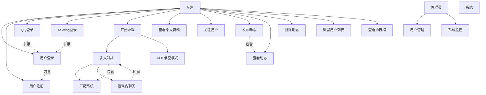

# TC-ACApp 用例图

## 系统用例图

## 用例说明

### 1. 开始游戏
- **用例名称**: 开始游戏
- **参与者**: 玩家
- **前置条件**: 用户已登录
- **后置条件**: 进入游戏界面
- **基本流程**:
  1. 用户点击"开始游戏"
  2. 系统显示游戏模式选择
  3. 用户选择游戏模式（多人对战/KOF拳皇）
  4. 系统加载对应游戏界面
- **异常流程**: 
  - 用户未登录：跳转到登录页面
  - 网络异常：显示错误提示

### 2. 多人对战
- **用例名称**: 多人对战
- **参与者**: 玩家
- **前置条件**: 用户已选择多人对战模式
- **后置条件**: 完成一局对战
- **基本流程**:
  1. 系统启动匹配算法
  2. 等待其他玩家加入
  3. 匹配成功后创建游戏房间
  4. 所有玩家进入房间
  5. 开始3人实时对战
  6. 游戏结束，结算积分
- **异常流程**:
  - 匹配超时：提示重新匹配
  - 玩家掉线：暂停游戏等待重连

### 3. 发布动态
- **用例名称**: 发布动态
- **参与者**: 玩家
- **前置条件**: 用户已登录
- **后置条件**: 动态发布成功
- **基本流程**:
  1. 用户进入个人空间
  2. 点击"发布动态"
  3. 输入动态内容
  4. 点击发布按钮
  5. 系统保存动态并显示
- **异常流程**:
  - 内容为空：提示输入内容
  - 内容超长：提示字数限制
