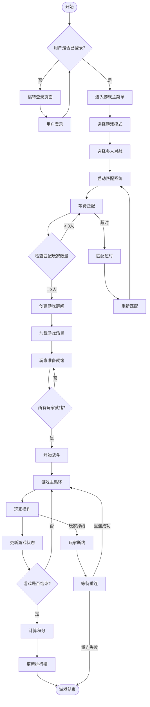
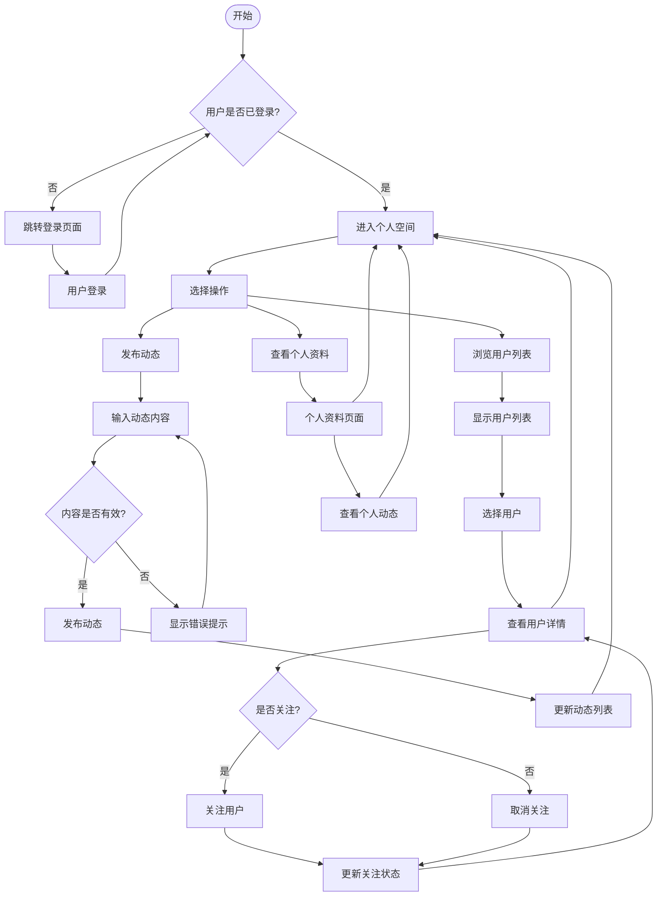
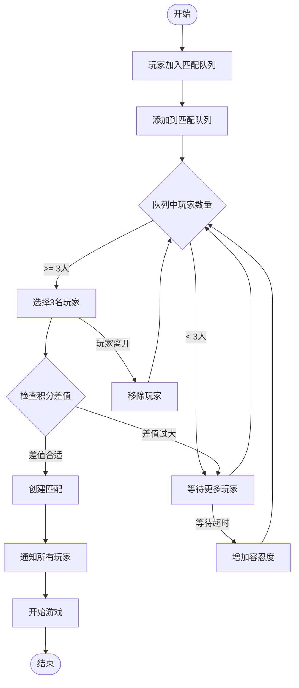
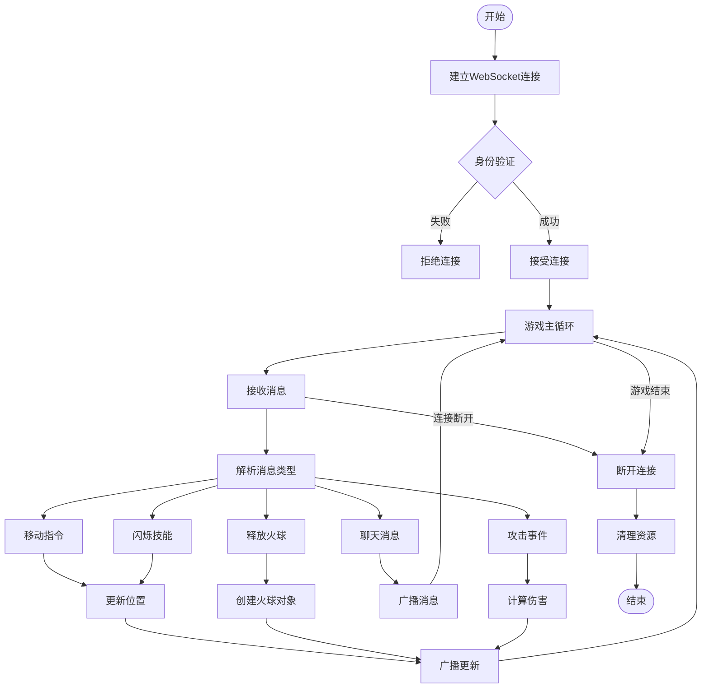

# TC-ACApp 活动图

## 1. 多人对战游戏流程活动图

```mermaid
flowchart TD
    Start([开始]) --> Login{用户是否已登录?}
    Login -->|否| LoginPage[跳转登录页面]
    LoginPage --> LoginProcess[用户登录]
    LoginProcess --> Login
    Login -->|是| GameMenu[进入游戏主菜单]
    
    GameMenu --> SelectMode[选择游戏模式]
    SelectMode --> MultiPlayer[选择多人对战]
    MultiPlayer --> StartMatch[启动匹配系统]
    
    StartMatch --> WaitMatch[等待匹配]
    WaitMatch --> CheckPlayers{检查匹配玩家数量}
    CheckPlayers -->|< 3人| WaitMatch
    CheckPlayers -->|= 3人| CreateRoom[创建游戏房间]
    
    CreateRoom --> LoadGame[加载游戏场景]
    LoadGame --> PlayerReady[玩家准备就绪]
    PlayerReady --> CheckAllReady{所有玩家就绪?}
    CheckAllReady -->|否| PlayerReady
    CheckAllReady -->|是| StartBattle[开始战斗]
    
    StartBattle --> GameLoop[游戏主循环]
    GameLoop --> PlayerAction[玩家操作]
    PlayerAction --> UpdateGame[更新游戏状态]
    UpdateGame --> CheckGameOver{游戏是否结束?}
    CheckGameOver -->|否| GameLoop
    CheckGameOver -->|是| CalculateScore[计算积分]
    
    CalculateScore --> UpdateRanking[更新排行榜]
    UpdateRanking --> GameEnd([游戏结束])
    
    %% 异常流程
    WaitMatch -->|超时| MatchTimeout[匹配超时]
    MatchTimeout --> RetryMatch[重新匹配]
    RetryMatch --> StartMatch
    
    PlayerAction -->|玩家掉线| PlayerDisconnect[玩家断线]
    PlayerDisconnect --> WaitReconnect[等待重连]
    WaitReconnect -->|重连成功| GameLoop
    WaitReconnect -->|重连失败| GameEnd
```

## 2. 用户社交互动流程活动图

```mermaid
flowchart TD
    Start([开始]) --> Login{用户是否已登录?}
    Login -->|否| LoginPage[跳转登录页面]
    LoginPage --> LoginProcess[用户登录]
    LoginProcess --> Login
    Login -->|是| MySpace[进入个人空间]
    
    MySpace --> SelectAction[选择操作]
    SelectAction --> BrowseUsers[浏览用户列表]
    SelectAction --> ViewProfile[查看个人资料]
    SelectAction --> PostDynamic[发布动态]
    
    %% 浏览用户流程
    BrowseUsers --> UserList[显示用户列表]
    UserList --> SelectUser[选择用户]
    SelectUser --> UserDetail[查看用户详情]
    UserDetail --> FollowAction{是否关注?}
    FollowAction -->|是| FollowUser[关注用户]
    FollowAction -->|否| UnfollowUser[取消关注]
    FollowUser --> UpdateFollow[更新关注状态]
    UnfollowUser --> UpdateFollow
    UpdateFollow --> UserDetail
    
    %% 发布动态流程
    PostDynamic --> InputContent[输入动态内容]
    InputContent --> ValidateContent{内容是否有效?}
    ValidateContent -->|否| ShowError[显示错误提示]
    ShowError --> InputContent
    ValidateContent -->|是| PublishPost[发布动态]
    PublishPost --> UpdateFeed[更新动态列表]
    UpdateFeed --> MySpace
    
    %% 查看个人资料流程
    ViewProfile --> ProfilePage[个人资料页面]
    ProfilePage --> ViewPosts[查看个人动态]
    ViewPosts --> MySpace
    
    UserDetail --> MySpace
    ProfilePage --> MySpace
```

## 3. 系统匹配算法活动图

```mermaid
flowchart TD
    Start([开始]) --> PlayerJoin[玩家加入匹配队列]
    PlayerJoin --> AddToQueue[添加到匹配队列]
    AddToQueue --> CheckQueue{队列中玩家数量}
    
    CheckQueue -->|< 3人| WaitMore[等待更多玩家]
    WaitMore --> CheckQueue
    
    CheckQueue -->|>= 3人| SelectPlayers[选择3名玩家]
    SelectPlayers --> CheckScore{检查积分差值}
    
    CheckScore -->|差值过大| WaitMore
    CheckScore -->|差值合适| CreateMatch[创建匹配]
    
    CreateMatch --> NotifyPlayers[通知所有玩家]
    NotifyPlayers --> StartGame[开始游戏]
    StartGame --> End([结束])
    
    %% 超时处理
    WaitMore -->|等待超时| IncreaseTolerance[增加容忍度]
    IncreaseTolerance --> CheckQueue
    
    %% 异常处理
    SelectPlayers -->|玩家离开| RemovePlayer[移除玩家]
    RemovePlayer --> CheckQueue
```

## 4. WebSocket实时通信活动图

```mermaid
flowchart TD
    Start([开始]) --> ConnectWS[建立WebSocket连接]
    ConnectWS --> AuthCheck{身份验证}
    AuthCheck -->|失败| Reject[拒绝连接]
    AuthCheck -->|成功| Accept[接受连接]
    
    Accept --> GameLoop[游戏主循环]
    GameLoop --> ReceiveMessage[接收消息]
    ReceiveMessage --> ParseMessage[解析消息类型]
    
    ParseMessage --> MoveTo[移动指令]
    ParseMessage --> ShootFireball[释放火球]
    ParseMessage --> Blink[闪烁技能]
    ParseMessage --> Chat[聊天消息]
    ParseMessage --> Attack[攻击事件]
    
    MoveTo --> UpdatePosition[更新位置]
    ShootFireball --> CreateFireball[创建火球对象]
    Blink --> UpdatePosition
    Chat --> BroadcastMessage[广播消息]
    Attack --> CalculateDamage[计算伤害]
    
    UpdatePosition --> BroadcastUpdate[广播更新]
    CreateFireball --> BroadcastUpdate
    BroadcastMessage --> GameLoop
    CalculateDamage --> BroadcastUpdate
    BroadcastUpdate --> GameLoop
    
    %% 异常处理
    ReceiveMessage -->|连接断开| Disconnect[断开连接]
    Disconnect --> Cleanup[清理资源]
    Cleanup --> End([结束])
    
    GameLoop -->|游戏结束| Disconnect
```
