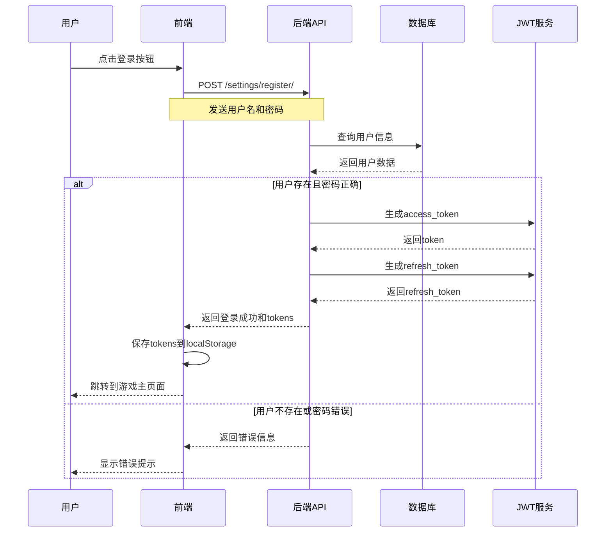
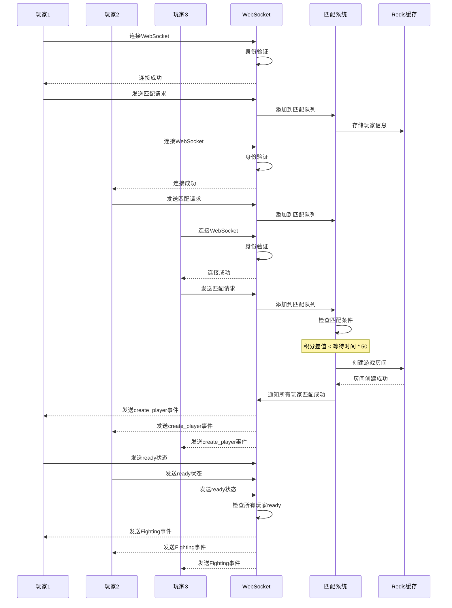
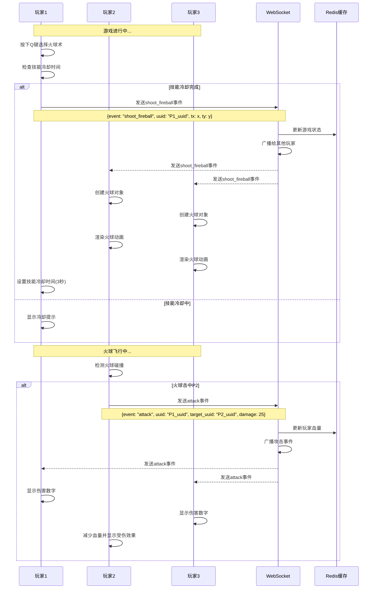
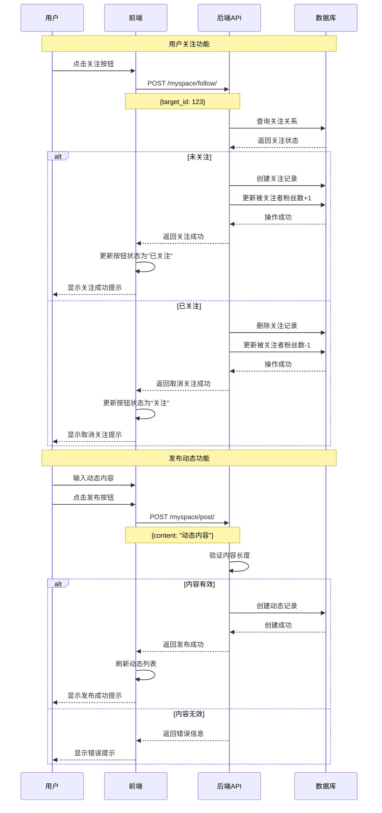
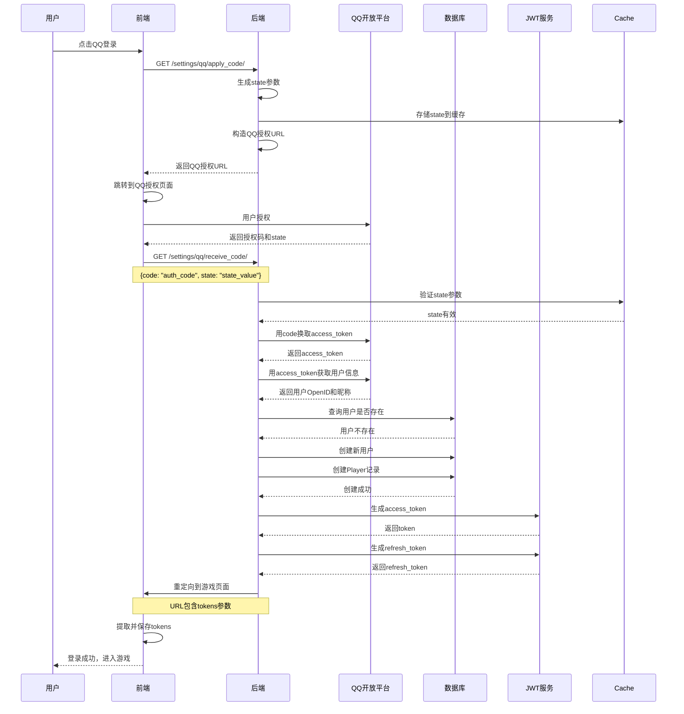
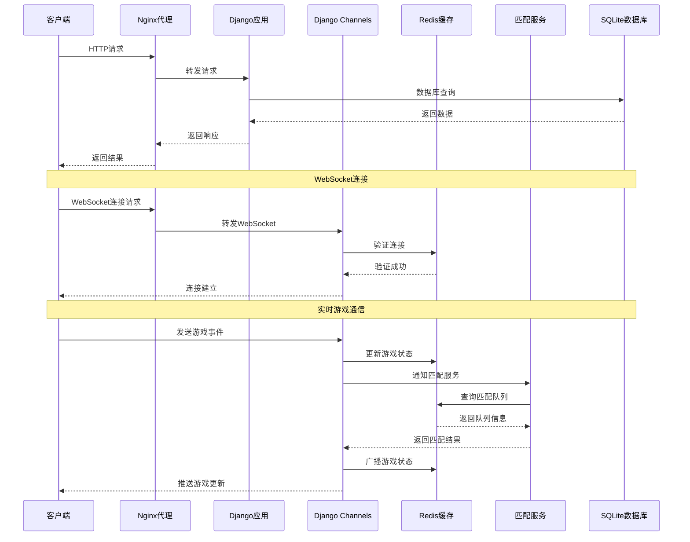

# TC-ACApp 顺序图

## 1. 用户登录顺序图

```mermaid
sequenceDiagram
    participant U as 用户
    participant F as 前端
    participant B as 后端API
    participant DB as 数据库
    participant JWT as JWT服务
    
    U->>F: 点击登录按钮
    F->>B: POST /settings/register/
    Note over F,B: 发送用户名和密码
    
    B->>DB: 查询用户信息
    DB-->>B: 返回用户数据
    
    alt 用户存在且密码正确
        B->>JWT: 生成access_token
        JWT-->>B: 返回token
        B->>JWT: 生成refresh_token
        JWT-->>B: 返回refresh_token
        B-->>F: 返回登录成功和tokens
        F->>F: 保存tokens到localStorage
        F-->>U: 跳转到游戏主页面
    else 用户不存在或密码错误
        B-->>F: 返回错误信息
        F-->>U: 显示错误提示
    end
```

## 2. 多人游戏匹配顺序图

```mermaid
sequenceDiagram
    participant P1 as 玩家1
    participant P2 as 玩家2
    participant P3 as 玩家3
    participant WS as WebSocket
    participant MS as 匹配系统
    participant Cache as Redis缓存
    
    P1->>WS: 连接WebSocket
    WS->>WS: 身份验证
    WS-->>P1: 连接成功
    
    P1->>WS: 发送匹配请求
    WS->>MS: 添加到匹配队列
    MS->>Cache: 存储玩家信息
    
    P2->>WS: 连接WebSocket
    WS->>WS: 身份验证
    WS-->>P2: 连接成功
    P2->>WS: 发送匹配请求
    WS->>MS: 添加到匹配队列
    
    P3->>WS: 连接WebSocket
    WS->>WS: 身份验证
    WS-->>P3: 连接成功
    P3->>WS: 发送匹配请求
    WS->>MS: 添加到匹配队列
    
    MS->>MS: 检查匹配条件
    Note over MS: 积分差值 < 等待时间 * 50
    
    MS->>Cache: 创建游戏房间
    Cache-->>MS: 房间创建成功
    
    MS->>WS: 通知所有玩家匹配成功
    WS-->>P1: 发送create_player事件
    WS-->>P2: 发送create_player事件
    WS-->>P3: 发送create_player事件
    
    P1->>WS: 发送ready状态
    P2->>WS: 发送ready状态
    P3->>WS: 发送ready状态
    
    WS->>WS: 检查所有玩家ready
    WS-->>P1: 发送Fighting事件
    WS-->>P2: 发送Fighting事件
    WS-->>P3: 发送Fighting事件
```

## 3. 游戏内技能释放顺序图

```mermaid
sequenceDiagram
    participant P1 as 玩家1
    participant P2 as 玩家2
    participant P3 as 玩家3
    participant WS as WebSocket
    participant Cache as Redis缓存
    
    Note over P1,P3: 游戏进行中...
    
    P1->>P1: 按下Q键选择火球术
    P1->>P1: 检查技能冷却时间
    alt 技能冷却完成
        P1->>WS: 发送shoot_fireball事件
        Note over P1,WS: {event: "shoot_fireball", uuid: "P1_uuid", tx: x, ty: y}
        
        WS->>Cache: 更新游戏状态
        WS->>WS: 广播给其他玩家
        
        WS-->>P2: 发送shoot_fireball事件
        WS-->>P3: 发送shoot_fireball事件
        
        P2->>P2: 创建火球对象
        P3->>P3: 创建火球对象
        
        P2->>P2: 渲染火球动画
        P3->>P3: 渲染火球动画
        
        P1->>P1: 设置技能冷却时间(3秒)
    else 技能冷却中
        P1->>P1: 显示冷却提示
    end
    
    Note over P1,P3: 火球飞行中...
    
    P2->>P2: 检测火球碰撞
    alt 火球击中P2
        P2->>WS: 发送attack事件
        Note over P2,WS: {event: "attack", uuid: "P1_uuid", target_uuid: "P2_uuid", damage: 25}
        
        WS->>Cache: 更新玩家血量
        WS->>WS: 广播攻击事件
        
        WS-->>P1: 发送attack事件
        WS-->>P3: 发送attack事件
        
        P1->>P1: 显示伤害数字
        P3->>P3: 显示伤害数字
        P2->>P2: 减少血量并显示受伤效果
    end
```

## 4. 社交功能顺序图

```mermaid
sequenceDiagram
    participant U as 用户
    participant F as 前端
    participant B as 后端API
    participant DB as 数据库
    
    Note over U,DB: 用户关注功能
    
    U->>F: 点击关注按钮
    F->>B: POST /myspace/follow/
    Note over F,B: {target_id: 123}
    
    B->>DB: 查询关注关系
    DB-->>B: 返回关注状态
    
    alt 未关注
        B->>DB: 创建关注记录
        B->>DB: 更新被关注者粉丝数+1
        DB-->>B: 操作成功
        B-->>F: 返回关注成功
        F->>F: 更新按钮状态为"已关注"
        F-->>U: 显示关注成功提示
    else 已关注
        B->>DB: 删除关注记录
        B->>DB: 更新被关注者粉丝数-1
        DB-->>B: 操作成功
        B-->>F: 返回取消关注成功
        F->>F: 更新按钮状态为"关注"
        F-->>U: 显示取消关注提示
    end
    
    Note over U,DB: 发布动态功能
    
    U->>F: 输入动态内容
    U->>F: 点击发布按钮
    F->>B: POST /myspace/post/
    Note over F,B: {content: "动态内容"}
    
    B->>B: 验证内容长度
    alt 内容有效
        B->>DB: 创建动态记录
        DB-->>B: 创建成功
        B-->>F: 返回发布成功
        F->>F: 刷新动态列表
        F-->>U: 显示发布成功提示
    else 内容无效
        B-->>F: 返回错误信息
        F-->>U: 显示错误提示
    end
```

## 5. QQ登录顺序图

```mermaid
sequenceDiagram
    participant U as 用户
    participant F as 前端
    participant B as 后端
    participant QQ as QQ开放平台
    participant DB as 数据库
    participant JWT as JWT服务
    
    U->>F: 点击QQ登录
    F->>B: GET /settings/qq/apply_code/
    
    B->>B: 生成state参数
    B->>Cache: 存储state到缓存
    B->>B: 构造QQ授权URL
    B-->>F: 返回QQ授权URL
    
    F->>F: 跳转到QQ授权页面
    F->>QQ: 用户授权
    QQ-->>F: 返回授权码和state
    
    F->>B: GET /settings/qq/receive_code/
    Note over F,B: {code: "auth_code", state: "state_value"}
    
    B->>Cache: 验证state参数
    Cache-->>B: state有效
    
    B->>QQ: 用code换取access_token
    QQ-->>B: 返回access_token
    
    B->>QQ: 用access_token获取用户信息
    QQ-->>B: 返回用户OpenID和昵称
    
    B->>DB: 查询用户是否存在
    DB-->>B: 用户不存在
    
    B->>DB: 创建新用户
    B->>DB: 创建Player记录
    DB-->>B: 创建成功
    
    B->>JWT: 生成access_token
    JWT-->>B: 返回token
    B->>JWT: 生成refresh_token
    JWT-->>B: 返回refresh_token
    
    B->>F: 重定向到游戏页面
    Note over B,F: URL包含tokens参数
    F->>F: 提取并保存tokens
    F-->>U: 登录成功，进入游戏
```

## 6. 系统架构通信顺序图

```mermaid
sequenceDiagram
    participant Client as 客户端
    participant Nginx as Nginx代理
    participant Django as Django应用
    participant Channels as Django Channels
    participant Redis as Redis缓存
    participant MatchSvc as 匹配服务
    participant DB as SQLite数据库
    
    Client->>Nginx: HTTP请求
    Nginx->>Django: 转发请求
    Django->>DB: 数据库查询
    DB-->>Django: 返回数据
    Django-->>Nginx: 返回响应
    Nginx-->>Client: 返回结果
    
    Note over Client,DB: WebSocket连接
    
    Client->>Nginx: WebSocket连接请求
    Nginx->>Channels: 转发WebSocket
    Channels->>Redis: 验证连接
    Redis-->>Channels: 验证成功
    Channels-->>Client: 连接建立
    
    Note over Client,DB: 实时游戏通信
    
    Client->>Channels: 发送游戏事件
    Channels->>Redis: 更新游戏状态
    Channels->>MatchSvc: 通知匹配服务
    MatchSvc->>Redis: 查询匹配队列
    Redis-->>MatchSvc: 返回队列信息
    MatchSvc-->>Channels: 返回匹配结果
    Channels->>Redis: 广播游戏状态
    Channels-->>Client: 推送游戏更新
```
