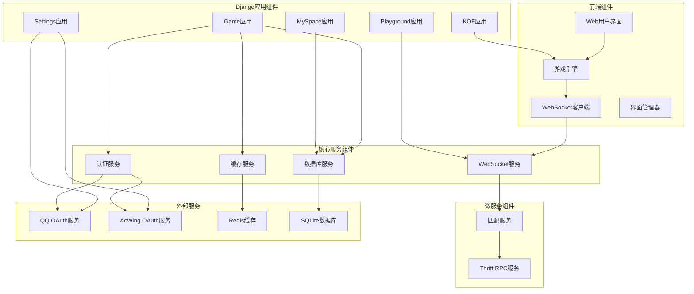
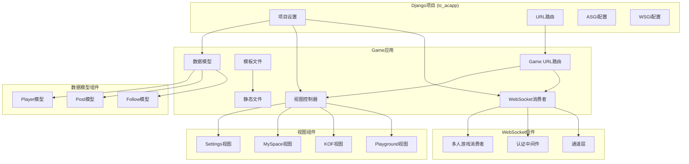
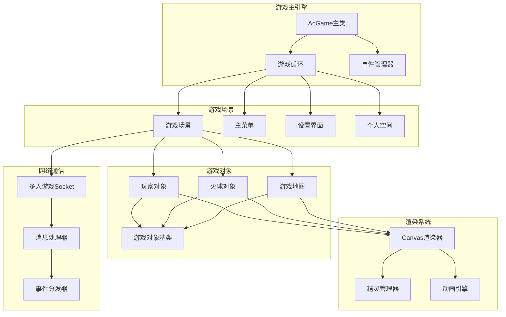
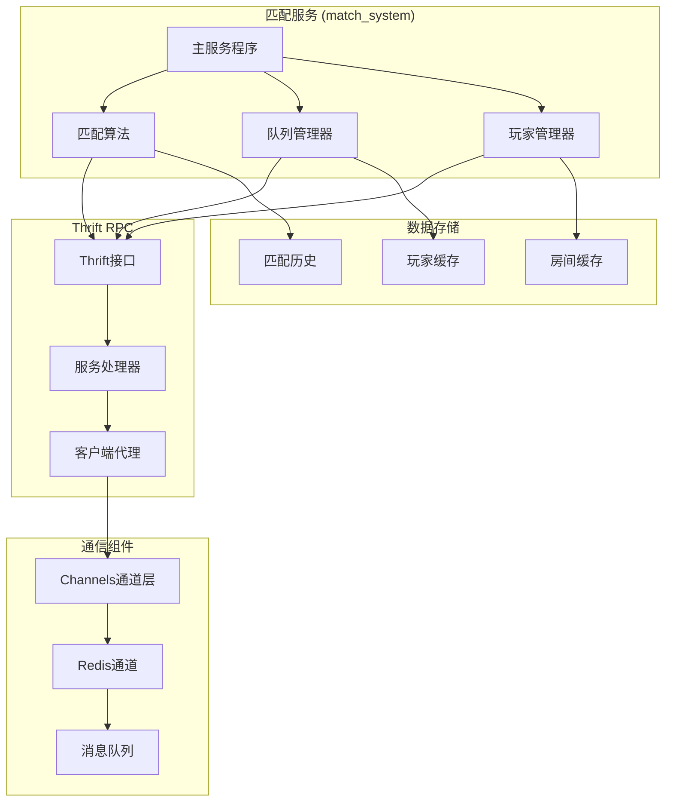
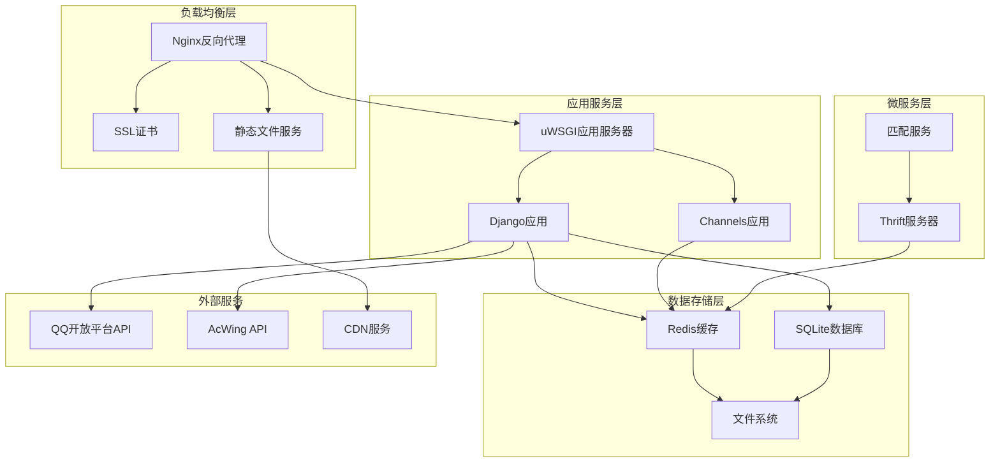
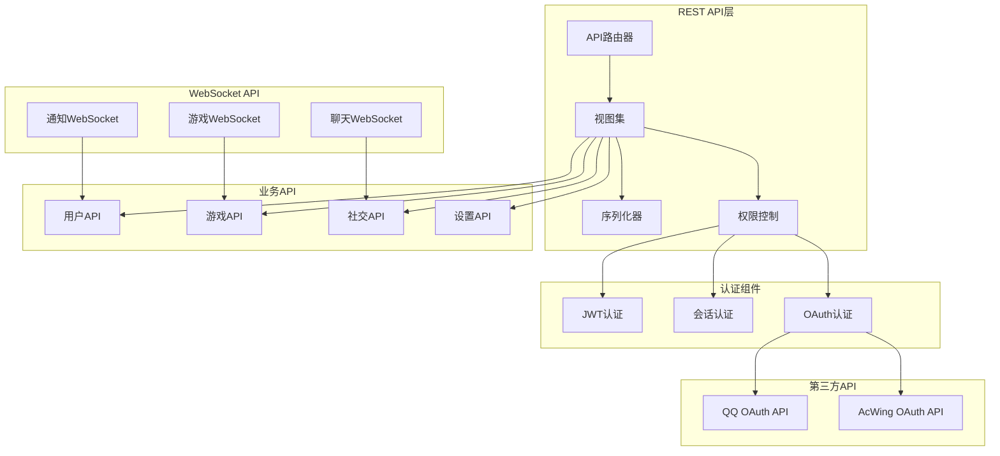

# TC-ACApp 构件图

## 1. 系统整体构件图

```mermaid
graph TB
    subgraph "前端组件"
        WebUI[Web用户界面]
        GameEngine[游戏引擎]
        SocketClient[WebSocket客户端]
        UIManager[界面管理器]
    end
    
    subgraph "Django应用组件"
        GameApp[Game应用]
        SettingsApp[Settings应用]
        MySpaceApp[MySpace应用]
        KOFApp[KOF应用]
        PlaygroundApp[Playground应用]
    end
    
    subgraph "核心服务组件"
        WebSocketService[WebSocket服务]
        AuthService[认证服务]
        CacheService[缓存服务]
        DatabaseService[数据库服务]
    end
    
    subgraph "微服务组件"
        MatchService[匹配服务]
        ThriftRPC[Thrift RPC服务]
    end
    
    subgraph "外部服务"
        QQOAuth[QQ OAuth服务]
        AcWingOAuth[AcWing OAuth服务]
        Redis[Redis缓存]
        SQLite[SQLite数据库]
    end
    
    %% 连接关系
    WebUI --> GameEngine
    GameEngine --> SocketClient
    SocketClient --> WebSocketService
    
    GameApp --> AuthService
    GameApp --> CacheService
    GameApp --> DatabaseService
    
    SettingsApp --> QQOAuth
    SettingsApp --> AcWingOAuth
    
    MySpaceApp --> DatabaseService
    KOFApp --> GameEngine
    PlaygroundApp --> WebSocketService
    
    WebSocketService --> MatchService
    MatchService --> ThriftRPC
    
    CacheService --> Redis
    DatabaseService --> SQLite
    
    AuthService --> QQOAuth
    AuthService --> AcWingOAuth
```

## 2. Django应用构件图

```mermaid
graph TB
    subgraph "Django项目 (tc_acapp)"
        Settings[项目设置]
        URLs[URL路由]
        ASGI[ASGI配置]
        WSGI[WSGI配置]
    end
    
    subgraph "Game应用"
        Models[数据模型]
        Views[视图控制器]
        Consumers[WebSocket消费者]
        Templates[模板文件]
        StaticFiles[静态文件]
        URLs_Game[Game URL路由]
    end
    
    subgraph "数据模型组件"
        PlayerModel[Player模型]
        PostModel[Post模型]
        FollowModel[Follow模型]
    end
    
    subgraph "视图组件"
        SettingsViews[Settings视图]
        MySpaceViews[MySpace视图]
        KOFViews[KOF视图]
        PlaygroundViews[Playground视图]
    end
    
    subgraph "WebSocket组件"
        MultiPlayerConsumer[多人游戏消费者]
        AuthMiddleware[认证中间件]
        ChannelLayer[通道层]
    end
    
    %% 连接关系
    Settings --> Models
    Settings --> Views
    Settings --> Consumers
    
    Models --> PlayerModel
    Models --> PostModel
    Models --> FollowModel
    
    Views --> SettingsViews
    Views --> MySpaceViews
    Views --> KOFViews
    Views --> PlaygroundViews
    
    Consumers --> MultiPlayerConsumer
    Consumers --> AuthMiddleware
    Consumers --> ChannelLayer
    
    URLs --> URLs_Game
    URLs_Game --> Views
    URLs_Game --> Consumers
    
    Templates --> StaticFiles
```

## 3. 前端游戏引擎构件图

```mermaid
graph TB
    subgraph "游戏主引擎"
        AcGame[AcGame主类]
        GameLoop[游戏循环]
        EventManager[事件管理器]
    end
    
    subgraph "游戏场景"
        Playground[游戏场景]
        Menu[主菜单]
        Settings[设置界面]
        MySpace[个人空间]
    end
    
    subgraph "游戏对象"
        Player[玩家对象]
        FireBall[火球对象]
        GameMap[游戏地图]
        AcGameObject[游戏对象基类]
    end
    
    subgraph "网络通信"
        MultiPlayerSocket[多人游戏Socket]
        MessageHandler[消息处理器]
        EventDispatcher[事件分发器]
    end
    
    subgraph "渲染系统"
        CanvasRenderer[Canvas渲染器]
        SpriteManager[精灵管理器]
        AnimationEngine[动画引擎]
    end
    
    %% 连接关系
    AcGame --> GameLoop
    AcGame --> EventManager
    GameLoop --> Playground
    GameLoop --> Menu
    GameLoop --> Settings
    GameLoop --> MySpace
    
    Playground --> Player
    Playground --> FireBall
    Playground --> GameMap
    
    Player --> AcGameObject
    FireBall --> AcGameObject
    GameMap --> AcGameObject
    
    Playground --> MultiPlayerSocket
    MultiPlayerSocket --> MessageHandler
    MessageHandler --> EventDispatcher
    
    Player --> CanvasRenderer
    FireBall --> CanvasRenderer
    GameMap --> CanvasRenderer
    
    CanvasRenderer --> SpriteManager
    CanvasRenderer --> AnimationEngine
```

## 4. 匹配系统构件图

```mermaid
graph TB
    subgraph "匹配服务 (match_system)"
        MainService[主服务程序]
        MatchAlgorithm[匹配算法]
        QueueManager[队列管理器]
        PlayerManager[玩家管理器]
    end
    
    subgraph "Thrift RPC"
        ThriftInterface[Thrift接口]
        ServiceHandler[服务处理器]
        ClientProxy[客户端代理]
    end
    
    subgraph "通信组件"
        ChannelLayer[Channels通道层]
        RedisChannel[Redis通道]
        MessageQueue[消息队列]
    end
    
    subgraph "数据存储"
        PlayerCache[玩家缓存]
        RoomCache[房间缓存]
        MatchHistory[匹配历史]
    end
    
    %% 连接关系
    MainService --> MatchAlgorithm
    MainService --> QueueManager
    MainService --> PlayerManager
    
    MatchAlgorithm --> ThriftInterface
    QueueManager --> ThriftInterface
    PlayerManager --> ThriftInterface
    
    ThriftInterface --> ServiceHandler
    ServiceHandler --> ClientProxy
    
    ClientProxy --> ChannelLayer
    ChannelLayer --> RedisChannel
    RedisChannel --> MessageQueue
    
    QueueManager --> PlayerCache
    PlayerManager --> RoomCache
    MatchAlgorithm --> MatchHistory
```

## 5. 部署架构构件图

```mermaid
graph TB
    subgraph "负载均衡层"
        Nginx[Nginx反向代理]
        SSL[SSL证书]
        StaticFiles[静态文件服务]
    end
    
    subgraph "应用服务层"
        uWSGI[uWSGI应用服务器]
        DjangoApp[Django应用]
        ChannelsApp[Channels应用]
    end
    
    subgraph "微服务层"
        MatchService[匹配服务]
        ThriftServer[Thrift服务器]
    end
    
    subgraph "数据存储层"
        Redis[Redis缓存]
        SQLite[SQLite数据库]
        FileSystem[文件系统]
    end
    
    subgraph "外部服务"
        QQAPI[QQ开放平台API]
        AcWingAPI[AcWing API]
        CDN[CDN服务]
    end
    
    %% 连接关系
    Nginx --> SSL
    Nginx --> StaticFiles
    Nginx --> uWSGI
    
    uWSGI --> DjangoApp
    uWSGI --> ChannelsApp
    
    DjangoApp --> Redis
    DjangoApp --> SQLite
    ChannelsApp --> Redis
    
    MatchService --> ThriftServer
    ThriftServer --> Redis
    
    DjangoApp --> QQAPI
    DjangoApp --> AcWingAPI
    StaticFiles --> CDN
    
    Redis --> FileSystem
    SQLite --> FileSystem
```

## 6. API接口构件图

```mermaid
graph TB
    subgraph "REST API层"
        APIRouter[API路由器]
        ViewSets[视图集]
        Serializers[序列化器]
        Permissions[权限控制]
    end
    
    subgraph "认证组件"
        JWTAuth[JWT认证]
        SessionAuth[会话认证]
        OAuthAuth[OAuth认证]
    end
    
    subgraph "业务API"
        UserAPI[用户API]
        GameAPI[游戏API]
        SocialAPI[社交API]
        SettingsAPI[设置API]
    end
    
    subgraph "WebSocket API"
        GameSocket[游戏WebSocket]
        ChatSocket[聊天WebSocket]
        NotificationSocket[通知WebSocket]
    end
    
    subgraph "第三方API"
        QQOAuthAPI[QQ OAuth API]
        AcWingOAuthAPI[AcWing OAuth API]
    end
    
    %% 连接关系
    APIRouter --> ViewSets
    ViewSets --> Serializers
    ViewSets --> Permissions
    
    Permissions --> JWTAuth
    Permissions --> SessionAuth
    Permissions --> OAuthAuth
    
    ViewSets --> UserAPI
    ViewSets --> GameAPI
    ViewSets --> SocialAPI
    ViewSets --> SettingsAPI
    
    GameSocket --> GameAPI
    ChatSocket --> SocialAPI
    NotificationSocket --> UserAPI
    
    OAuthAuth --> QQOAuthAPI
    OAuthAuth --> AcWingOAuthAPI
```
