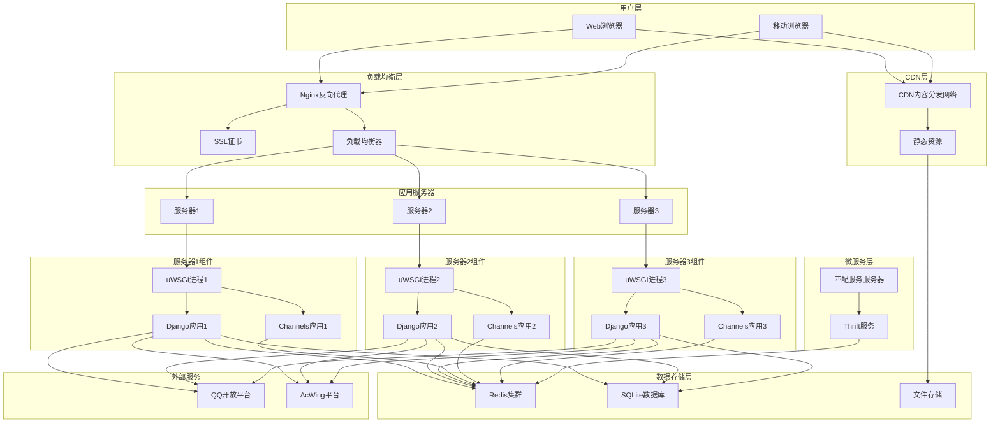
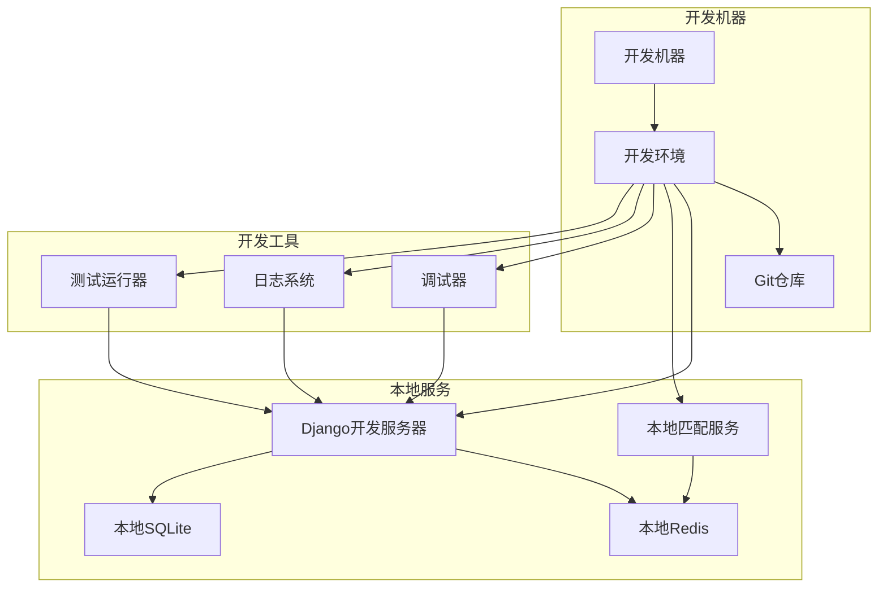
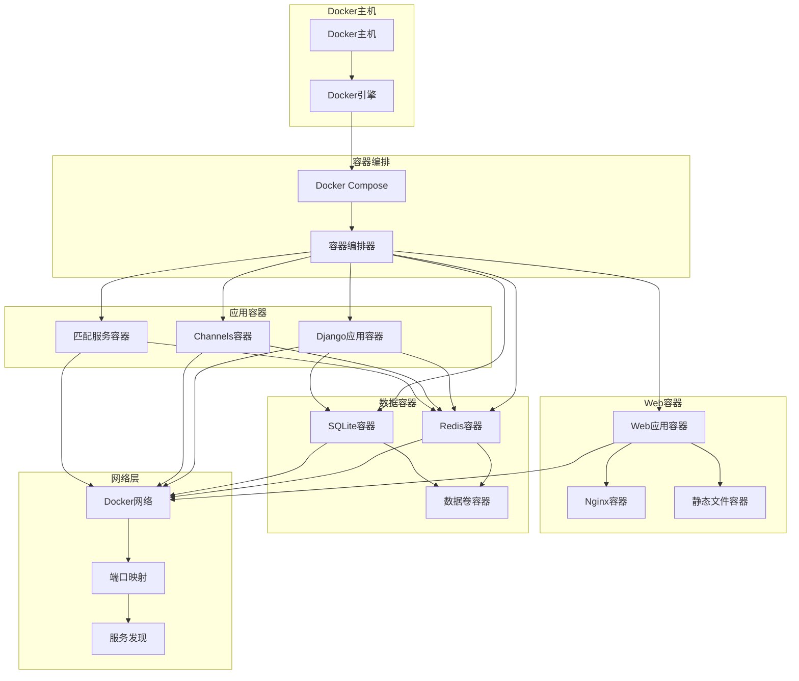
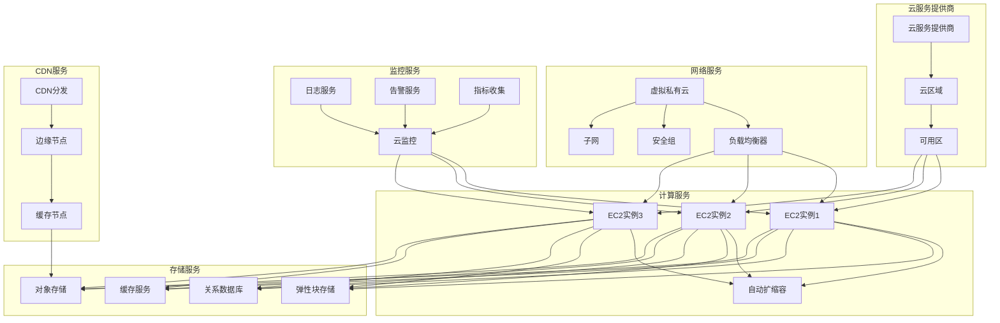
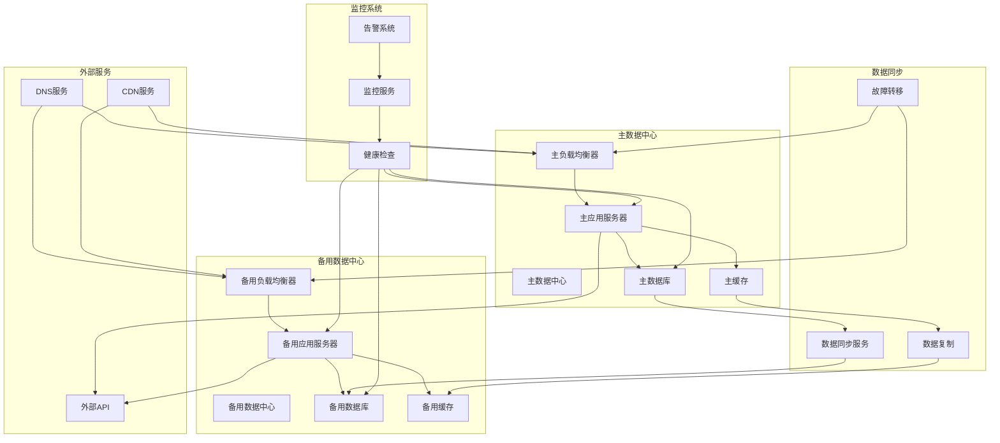
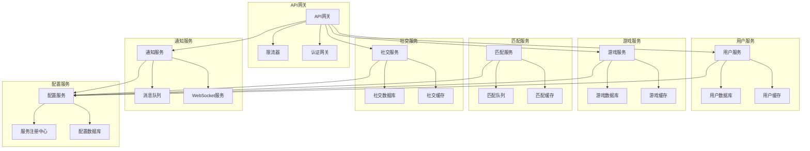

# TC-ACApp 部署图

## 1. 生产环境部署图

```mermaid
graph TB
    subgraph "用户层"
        WebBrowser[Web浏览器]
        MobileBrowser[移动浏览器]
    end
    
    subgraph "CDN层"
        CDN[CDN内容分发网络]
        StaticAssets[静态资源]
    end
    
    subgraph "负载均衡层"
        Nginx[Nginx反向代理]
        SSL[SSL证书]
        LoadBalancer[负载均衡器]
    end
    
    subgraph "应用服务器"
        Server1[服务器1]
        Server2[服务器2]
        Server3[服务器3]
    end
    
    subgraph "服务器1组件"
        uWSGI1[uWSGI进程1]
        DjangoApp1[Django应用1]
        Channels1[Channels应用1]
    end
    
    subgraph "服务器2组件"
        uWSGI2[uWSGI进程2]
        DjangoApp2[Django应用2]
        Channels2[Channels应用2]
    end
    
    subgraph "服务器3组件"
        uWSGI3[uWSGI进程3]
        DjangoApp3[Django应用3]
        Channels3[Channels应用3]
    end
    
    subgraph "微服务层"
        MatchServer[匹配服务服务器]
        ThriftService[Thrift服务]
    end
    
    subgraph "数据存储层"
        RedisCluster[Redis集群]
        SQLiteDB[SQLite数据库]
        FileStorage[文件存储]
    end
    
    subgraph "外部服务"
        QQAPI[QQ开放平台]
        AcWingAPI[AcWing平台]
    end
    
    %% 连接关系
    WebBrowser --> CDN
    MobileBrowser --> CDN
    CDN --> StaticAssets
    
    WebBrowser --> Nginx
    MobileBrowser --> Nginx
    Nginx --> SSL
    Nginx --> LoadBalancer
    
    LoadBalancer --> Server1
    LoadBalancer --> Server2
    LoadBalancer --> Server3
    
    Server1 --> uWSGI1
    uWSGI1 --> DjangoApp1
    uWSGI1 --> Channels1
    
    Server2 --> uWSGI2
    uWSGI2 --> DjangoApp2
    uWSGI2 --> Channels2
    
    Server3 --> uWSGI3
    uWSGI3 --> DjangoApp3
    uWSGI3 --> Channels3
    
    DjangoApp1 --> RedisCluster
    DjangoApp2 --> RedisCluster
    DjangoApp3 --> RedisCluster
    
    Channels1 --> RedisCluster
    Channels2 --> RedisCluster
    Channels3 --> RedisCluster
    
    DjangoApp1 --> SQLiteDB
    DjangoApp2 --> SQLiteDB
    DjangoApp3 --> SQLiteDB
    
    MatchServer --> ThriftService
    ThriftService --> RedisCluster
    
    DjangoApp1 --> QQAPI
    DjangoApp2 --> QQAPI
    DjangoApp3 --> QQAPI
    
    DjangoApp1 --> AcWingAPI
    DjangoApp2 --> AcWingAPI
    DjangoApp3 --> AcWingAPI
    
    StaticAssets --> FileStorage
```

## 2. 开发环境部署图

```mermaid
graph TB
    subgraph "开发机器"
        DevMachine[开发机器]
        IDE[开发环境]
        GitRepo[Git仓库]
    end
    
    subgraph "本地服务"
        DjangoDev[Django开发服务器]
        RedisLocal[本地Redis]
        SQLiteLocal[本地SQLite]
        MatchLocal[本地匹配服务]
    end
    
    subgraph "开发工具"
        Debugger[调试器]
        Logger[日志系统]
        TestRunner[测试运行器]
    end
    
    %% 连接关系
    DevMachine --> IDE
    IDE --> GitRepo
    IDE --> DjangoDev
    IDE --> MatchLocal
    
    DjangoDev --> RedisLocal
    DjangoDev --> SQLiteLocal
    MatchLocal --> RedisLocal
    
    IDE --> Debugger
    IDE --> Logger
    IDE --> TestRunner
    
    Debugger --> DjangoDev
    Logger --> DjangoDev
    TestRunner --> DjangoDev
```

## 3. 容器化部署图

```mermaid
graph TB
    subgraph "Docker主机"
        DockerHost[Docker主机]
        DockerEngine[Docker引擎]
    end
    
    subgraph "容器编排"
        DockerCompose[Docker Compose]
        ContainerOrchestrator[容器编排器]
    end
    
    subgraph "Web容器"
        WebContainer[Web应用容器]
        NginxContainer[Nginx容器]
        StaticContainer[静态文件容器]
    end
    
    subgraph "应用容器"
        DjangoContainer[Django应用容器]
        ChannelsContainer[Channels容器]
        MatchContainer[匹配服务容器]
    end
    
    subgraph "数据容器"
        RedisContainer[Redis容器]
        SQLiteContainer[SQLite容器]
        VolumeContainer[数据卷容器]
    end
    
    subgraph "网络层"
        DockerNetwork[Docker网络]
        PortMapping[端口映射]
        ServiceDiscovery[服务发现]
    end
    
    %% 连接关系
    DockerHost --> DockerEngine
    DockerEngine --> DockerCompose
    DockerCompose --> ContainerOrchestrator
    
    ContainerOrchestrator --> WebContainer
    ContainerOrchestrator --> DjangoContainer
    ContainerOrchestrator --> ChannelsContainer
    ContainerOrchestrator --> MatchContainer
    ContainerOrchestrator --> RedisContainer
    ContainerOrchestrator --> SQLiteContainer
    
    WebContainer --> NginxContainer
    WebContainer --> StaticContainer
    
    DjangoContainer --> RedisContainer
    DjangoContainer --> SQLiteContainer
    ChannelsContainer --> RedisContainer
    MatchContainer --> RedisContainer
    
    RedisContainer --> VolumeContainer
    SQLiteContainer --> VolumeContainer
    
    DockerNetwork --> PortMapping
    PortMapping --> ServiceDiscovery
    
    WebContainer --> DockerNetwork
    DjangoContainer --> DockerNetwork
    ChannelsContainer --> DockerNetwork
    MatchContainer --> DockerNetwork
    RedisContainer --> DockerNetwork
    SQLiteContainer --> DockerNetwork
```

## 4. 云服务部署图

```mermaid
graph TB
    subgraph "云服务提供商"
        CloudProvider[云服务提供商]
        CloudRegion[云区域]
        AvailabilityZone[可用区]
    end
    
    subgraph "计算服务"
        EC2Instance1[EC2实例1]
        EC2Instance2[EC2实例2]
        EC2Instance3[EC2实例3]
        AutoScaling[自动扩缩容]
    end
    
    subgraph "网络服务"
        VPC[虚拟私有云]
        LoadBalancer[负载均衡器]
        SecurityGroup[安全组]
        Subnet[子网]
    end
    
    subgraph "存储服务"
        EBS[弹性块存储]
        S3[对象存储]
        RDS[关系数据库]
        ElastiCache[缓存服务]
    end
    
    subgraph "监控服务"
        CloudWatch[云监控]
        Logs[日志服务]
        Alerts[告警服务]
        Metrics[指标收集]
    end
    
    subgraph "CDN服务"
        CloudFront[CDN分发]
        EdgeLocation[边缘节点]
        Cache[缓存节点]
    end
    
    %% 连接关系
    CloudProvider --> CloudRegion
    CloudRegion --> AvailabilityZone
    
    AvailabilityZone --> EC2Instance1
    AvailabilityZone --> EC2Instance2
    AvailabilityZone --> EC2Instance3
    
    EC2Instance1 --> AutoScaling
    EC2Instance2 --> AutoScaling
    EC2Instance3 --> AutoScaling
    
    VPC --> LoadBalancer
    VPC --> SecurityGroup
    VPC --> Subnet
    
    LoadBalancer --> EC2Instance1
    LoadBalancer --> EC2Instance2
    LoadBalancer --> EC2Instance3
    
    EC2Instance1 --> EBS
    EC2Instance2 --> EBS
    EC2Instance3 --> EBS
    
    EC2Instance1 --> RDS
    EC2Instance2 --> RDS
    EC2Instance3 --> RDS
    
    EC2Instance1 --> ElastiCache
    EC2Instance2 --> ElastiCache
    EC2Instance3 --> ElastiCache
    
    EC2Instance1 --> S3
    EC2Instance2 --> S3
    EC2Instance3 --> S3
    
    CloudWatch --> EC2Instance1
    CloudWatch --> EC2Instance2
    CloudWatch --> EC2Instance3
    
    Logs --> CloudWatch
    Alerts --> CloudWatch
    Metrics --> CloudWatch
    
    CloudFront --> EdgeLocation
    EdgeLocation --> Cache
    Cache --> S3
```

## 5. 高可用部署图

```mermaid
graph TB
    subgraph "主数据中心"
        PrimaryDC[主数据中心]
        PrimaryLB[主负载均衡器]
        PrimaryApp[主应用服务器]
        PrimaryDB[主数据库]
        PrimaryCache[主缓存]
    end
    
    subgraph "备用数据中心"
        BackupDC[备用数据中心]
        BackupLB[备用负载均衡器]
        BackupApp[备用应用服务器]
        BackupDB[备用数据库]
        BackupCache[备用缓存]
    end
    
    subgraph "数据同步"
        DataSync[数据同步服务]
        Replication[数据复制]
        Failover[故障转移]
    end
    
    subgraph "监控系统"
        HealthCheck[健康检查]
        Monitoring[监控服务]
        Alerting[告警系统]
    end
    
    subgraph "外部服务"
        DNS[DNS服务]
        CDN[CDN服务]
        ExternalAPI[外部API]
    end
    
    %% 连接关系
    DNS --> PrimaryLB
    DNS --> BackupLB
    
    PrimaryLB --> PrimaryApp
    BackupLB --> BackupApp
    
    PrimaryApp --> PrimaryDB
    PrimaryApp --> PrimaryCache
    BackupApp --> BackupDB
    BackupApp --> BackupCache
    
    PrimaryDB --> DataSync
    DataSync --> BackupDB
    
    PrimaryCache --> Replication
    Replication --> BackupCache
    
    HealthCheck --> PrimaryApp
    HealthCheck --> BackupApp
    HealthCheck --> PrimaryDB
    HealthCheck --> BackupDB
    
    Monitoring --> HealthCheck
    Alerting --> Monitoring
    
    Failover --> PrimaryLB
    Failover --> BackupLB
    
    PrimaryApp --> ExternalAPI
    BackupApp --> ExternalAPI
    
    CDN --> PrimaryLB
    CDN --> BackupLB
```

## 6. 微服务部署图

```mermaid
graph TB
    subgraph "API网关"
        APIGateway[API网关]
        RateLimiter[限流器]
        AuthGateway[认证网关]
    end
    
    subgraph "用户服务"
        UserService[用户服务]
        UserDB[用户数据库]
        UserCache[用户缓存]
    end
    
    subgraph "游戏服务"
        GameService[游戏服务]
        GameDB[游戏数据库]
        GameCache[游戏缓存]
    end
    
    subgraph "匹配服务"
        MatchService[匹配服务]
        MatchQueue[匹配队列]
        MatchCache[匹配缓存]
    end
    
    subgraph "社交服务"
        SocialService[社交服务]
        SocialDB[社交数据库]
        SocialCache[社交缓存]
    end
    
    subgraph "通知服务"
        NotificationService[通知服务]
        MessageQueue[消息队列]
        WebSocketService[WebSocket服务]
    end
    
    subgraph "配置服务"
        ConfigService[配置服务]
        ServiceRegistry[服务注册中心]
        ConfigDB[配置数据库]
    end
    
    %% 连接关系
    APIGateway --> RateLimiter
    APIGateway --> AuthGateway
    
    APIGateway --> UserService
    APIGateway --> GameService
    APIGateway --> SocialService
    APIGateway --> NotificationService
    
    UserService --> UserDB
    UserService --> UserCache
    
    GameService --> GameDB
    GameService --> GameCache
    
    MatchService --> MatchQueue
    MatchService --> MatchCache
    
    SocialService --> SocialDB
    SocialService --> SocialCache
    
    NotificationService --> MessageQueue
    NotificationService --> WebSocketService
    
    ConfigService --> ServiceRegistry
    ConfigService --> ConfigDB
    
    UserService --> ConfigService
    GameService --> ConfigService
    MatchService --> ConfigService
    SocialService --> ConfigService
    NotificationService --> ConfigService
```
