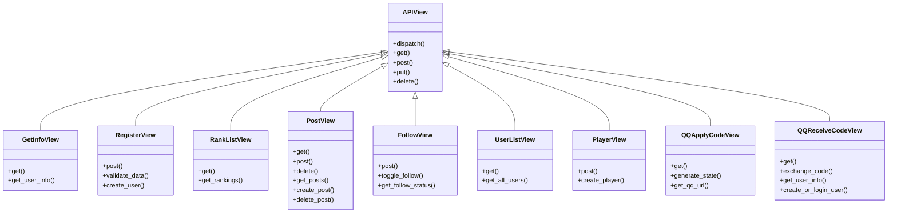

# TC-ACApp 类图

## 1. PIM类图（平台无关模型）

```mermaid
classDiagram
    class Player {
        +String username
        +String photo
        +Integer score
        +Integer followerCount
        +String openid
        +login()
        +logout()
        +updateScore()
        +getProfile()
    }
    
    class Game {
        +String gameId
        +String gameType
        +List~Player~ players
        +GameStatus status
        +startGame()
        +endGame()
        +addPlayer()
        +removePlayer()
    }
    
    class Room {
        +String roomId
        +List~Player~ players
        +RoomStatus status
        +DateTime createTime
        +createRoom()
        +joinRoom()
        +leaveRoom()
        +startBattle()
    }
    
    class Post {
        +Integer postId
        +Integer userId
        +String content
        +DateTime createTime
        +createPost()
        +deletePost()
        +getPosts()
    }
    
    class Follow {
        +Integer sourceId
        +Integer targetId
        +DateTime followTime
        +follow()
        +unfollow()
        +getFollowers()
        +getFollowing()
    }
    
    class Skill {
        +String skillName
        +Integer cooldown
        +Integer damage
        +Integer range
        +useSkill()
        +checkCooldown()
    }
    
    class MatchSystem {
        +List~Player~ waitingQueue
        +Integer maxWaitTime
        +matchPlayers()
        +addToQueue()
        +removeFromQueue()
        +checkCompatibility()
    }
    
    %% 关系定义
    Player ||--o{ Post : "发布"
    Player ||--o{ Follow : "关注"
    Player ||--o{ Follow : "被关注"
    Player ||--o{ Game : "参与"
    Game ||--|| Room : "包含"
    Room ||--o{ Player : "容纳"
    Player ||--o{ Skill : "使用"
    MatchSystem ||--o{ Player : "匹配"
```

## 2. 设计类图（基于Django实现）

```mermaid
classDiagram
    class User {
        +Integer id
        +String username
        +String password
        +String email
        +Boolean is_active
        +DateTime date_joined
        +save()
        +delete()
        +check_password()
    }
    
    class Player {
        +User user
        +String photo
        +String openid
        +Integer score
        +Integer followerCount
        +save()
        +delete()
        +update_score()
        +get_followers()
        +get_following()
    }
    
    class Post {
        +Integer id
        +Integer user_id
        +String content
        +DateTime createtime
        +save()
        +delete()
        +get_user_posts()
    }
    
    class Follow {
        +Integer id
        +Integer source
        +Integer target
        +save()
        +delete()
        +is_following()
        +toggle_follow()
    }
    
    class GameRoom {
        +String room_name
        +List~Dict~ players
        +Integer status
        +DateTime create_time
        +add_player()
        +remove_player()
        +get_players()
        +update_status()
    }
    
    class WebSocketConsumer {
        +String room_name
        +String uuid
        +User user
        +connect()
        +disconnect()
        +receive()
        +create_player()
        +move_to()
        +shoot_fireball()
        +attack()
        +blink()
        +message()
        +group_send_event()
    }
    
    class MatchService {
        +List~Player~ waiting_queue
        +Integer max_wait_time
        +add_player()
        +remove_player()
        +match_players()
        +check_match()
        +match_success()
    }
    
    class FireBall {
        +String uuid
        +Player player
        +Float x
        +Float y
        +Float vx
        +Float vy
        +Float radius
        +Integer damage
        +update()
        +render()
        +attack()
    }
    
    class PlayerObject {
        +String uuid
        +String username
        +String photo
        +Float x
        +Float y
        +Float radius
        +Integer hp
        +Float speed
        +Float fireball_coldtime
        +Float blink_coldtime
        +move_to()
        +shoot_fireball()
        +blink()
        +attack()
        +update()
        +render()
    }
    
    %% 关系定义
    User ||--|| Player : "一对一"
    Player ||--o{ Post : "一对多"
    Player ||--o{ Follow : "关注者"
    Player ||--o{ Follow : "被关注者"
    GameRoom ||--o{ Player : "容纳"
    WebSocketConsumer ||--|| Player : "关联"
    MatchService ||--o{ Player : "匹配"
    PlayerObject ||--o{ FireBall : "释放"
    WebSocketConsumer ||--|| GameRoom : "管理"
```

## 3. 前端游戏引擎类图

```mermaid
classDiagram
    class AcGame {
        +String id
        +Settings settings
        +AcGameMenu menu
        +AcGamePlayground playground
        +start()
        +update()
        +render()
    }
    
    class AcGamePlayground {
        +String id
        +AcGame ac_game
        +MultiPlayerSocket mps
        +List~Player~ players
        +GameMap game_map
        +start()
        +update()
        +render()
        +create_uuid()
    }
    
    class MultiPlayerSocket {
        +WebSocket ws
        +String uuid
        +AcGamePlayground playground
        +connect()
        +disconnect()
        +send_create_player()
        +send_move_to()
        +send_shoot_fireball()
        +send_attack()
        +send_blink()
        +send_message()
        +receive()
    }
    
    class Player {
        +String uuid
        +String username
        +String photo
        +Float x
        +Float y
        +Float radius
        +Integer hp
        +Float speed
        +Float fireball_coldtime
        +Float blink_coldtime
        +List~FireBall~ fireballs
        +move_to()
        +shoot_fireball()
        +blink()
        +attack()
        +update()
        +render()
        +get_dist()
        +is_attacked()
    }
    
    class FireBall {
        +String uuid
        +Player player
        +AcGamePlayground playground
        +Float x
        +Float y
        +Float vx
        +Float vy
        +Float radius
        +Float speed
        +Integer damage
        +String color
        +Float move_length
        +Float total_length
        +update()
        +render()
        +attack()
        +destroy()
    }
    
    class GameMap {
        +AcGamePlayground playground
        +Float width
        +Float height
        +update()
        +render()
    }
    
    class AcGameObject {
        +String uuid
        +Boolean has_called_start
        +Float timedelta
        +create_uuid()
        +start()
        +update()
        +update_time()
        +update_game_logic()
        +render()
    }
    
    %% 关系定义
    AcGame ||--|| AcGamePlayground : "包含"
    AcGamePlayground ||--|| MultiPlayerSocket : "包含"
    AcGamePlayground ||--o{ Player : "包含"
    AcGamePlayground ||--|| GameMap : "包含"
    Player ||--o{ FireBall : "释放"
    Player --|> AcGameObject : "继承"
    FireBall --|> AcGameObject : "继承"
    GameMap --|> AcGameObject : "继承"
```

## 4. API接口类图


