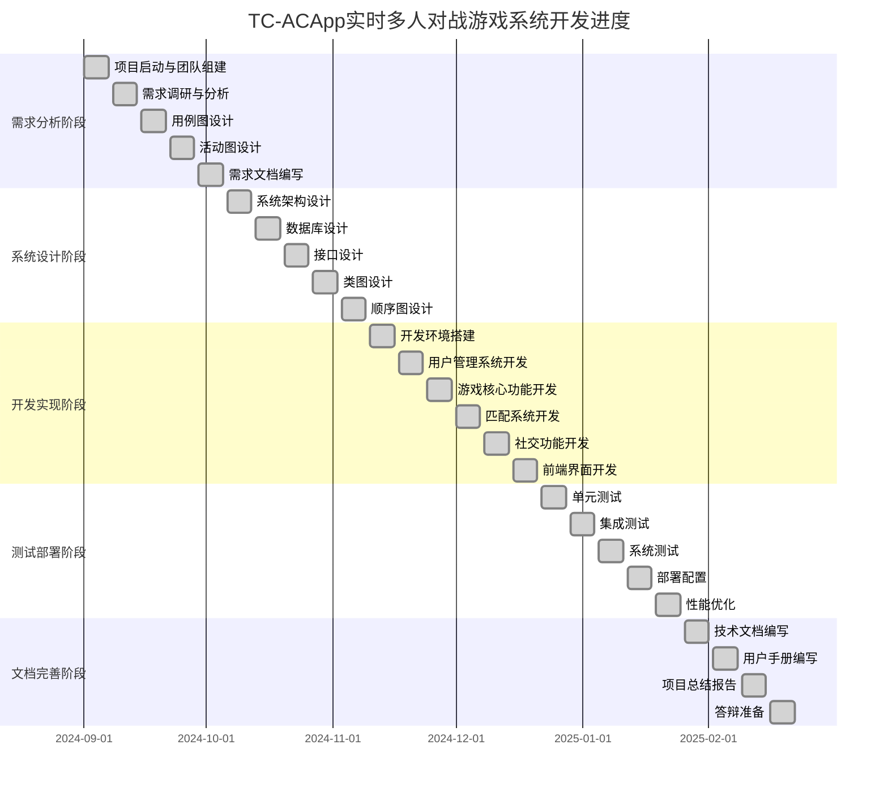

# 07-项目进度甘特图

## 概述

本文档展示了TC-ACApp实时多人对战游戏系统的完整项目进度安排，采用甘特图形式展示各个开发阶段、任务分配和时间安排。

## 项目进度甘特图

## 详细进度说明

### 第一阶段：需求分析阶段（5周）

#### 第1周：项目启动与团队组建
- **负责人**：吕文潇（组长）
- **主要任务**：
  - 确定项目目标和范围
  - 分配团队成员角色和职责
  - 制定项目计划和里程碑
  - 建立团队沟通机制

#### 第2周：需求调研与分析
- **负责人**：朱旭
- **主要任务**：
  - 市场调研和竞品分析
  - 用户需求收集和分析
  - 功能需求和非功能需求定义
  - 需求优先级排序

#### 第3周：用例图设计
- **负责人**：朱旭
- **主要任务**：
  - 识别系统参与者和用例
  - 设计用例图和用例关系
  - 编写用例说明文档
  - 用例评审和确认

#### 第4周：活动图设计
- **负责人**：刘喻莹
- **主要任务**：
  - 设计关键业务流程的活动图
  - 分析业务对象和业务规则
  - 完善业务建模文档
  - 业务流程优化

#### 第5周：需求文档编写
- **负责人**：全体成员
- **主要任务**：
  - 整理需求分析结果
  - 编写需求规格说明书
  - 需求评审和确认
  - 需求变更管理

### 第二阶段：系统设计阶段（5周）

#### 第6周：系统架构设计
- **负责人**：吕文潇
- **主要任务**：
  - 确定系统整体架构
  - 设计技术选型和架构模式
  - 制定架构设计文档
  - 架构评审和确认

#### 第7周：数据库设计
- **负责人**：吴蕊
- **主要任务**：
  - 设计数据模型和ER图
  - 定义数据库表结构
  - 制定数据库设计规范
  - 数据库性能优化设计

#### 第8周：接口设计
- **负责人**：吴蕊
- **主要任务**：
  - 设计API接口规范
  - 定义接口参数和返回值
  - 制定接口设计文档
  - 接口安全设计

#### 第9周：类图设计
- **负责人**：吴蕊
- **主要任务**：
  - 设计PIM类图
  - 定义类之间的关系
  - 完善面向对象设计
  - 设计模式应用

#### 第10周：顺序图设计
- **负责人**：陈亦可
- **主要任务**：
  - 设计关键场景的顺序图
  - 分析系统交互流程
  - 完善交互设计文档
  - 时序优化设计

### 第三阶段：开发实现阶段（6周）

#### 第11周：开发环境搭建
- **负责人**：吕文潇
- **主要任务**：
  - 配置开发环境和工具
  - 搭建项目框架和基础结构
  - 制定开发规范和流程
  - 版本控制配置

#### 第12周：用户管理系统开发
- **负责人**：朱旭
- **主要任务**：
  - 实现用户注册和登录功能
  - 开发第三方登录（QQ、AcWing）
  - 实现用户认证和权限管理
  - 用户数据管理

#### 第13周：游戏核心功能开发
- **负责人**：吕文潇、陈亦可
- **主要任务**：
  - 实现游戏引擎和渲染系统
  - 开发游戏逻辑和物理引擎
  - 实现技能系统和战斗机制
  - 游戏性能优化

#### 第14周：匹配系统开发
- **负责人**：陈亦可
- **主要任务**：
  - 开发智能匹配算法
  - 实现实时通信功能
  - 集成Thrift RPC服务
  - 匹配系统优化

#### 第15周：社交功能开发
- **负责人**：刘喻莹
- **主要任务**：
  - 实现用户关注和粉丝系统
  - 开发动态发布和评论功能
  - 实现个人空间和用户互动
  - 社交功能优化

#### 第16周：前端界面开发
- **负责人**：刘喻莹
- **主要任务**：
  - 开发响应式Web界面
  - 实现游戏UI和交互效果
  - 优化用户体验和界面设计
  - 前端性能优化

### 第四阶段：测试部署阶段（5周）

#### 第17周：单元测试
- **负责人**：全体成员
- **主要任务**：
  - 编写单元测试用例
  - 执行代码测试和调试
  - 修复发现的问题
  - 代码质量检查

#### 第18周：集成测试
- **负责人**：陈亦可
- **主要任务**：
  - 进行模块集成测试
  - 测试系统接口和通信
  - 验证系统功能完整性
  - 集成问题修复

#### 第19周：系统测试
- **负责人**：刘喻莹
- **主要任务**：
  - 进行端到端系统测试
  - 性能测试和压力测试
  - 安全测试和漏洞扫描
  - 系统优化调整

#### 第20周：部署配置
- **负责人**：吕文潇
- **主要任务**：
  - 配置生产环境
  - 部署系统到服务器
  - 配置监控和日志系统
  - 部署文档编写

#### 第21周：性能优化
- **负责人**：吴蕊
- **主要任务**：
  - 优化系统性能
  - 调整配置参数
  - 完善监控和告警
  - 性能测试验证

### 第五阶段：文档完善阶段（5周）

#### 第22周：技术文档编写
- **负责人**：吕文潇
- **主要任务**：
  - 编写系统设计文档
  - 完善API文档和开发指南
  - 整理技术实现细节
  - 技术文档评审

#### 第23周：用户手册编写
- **负责人**：刘喻莹
- **主要任务**：
  - 编写用户使用手册
  - 制作操作指南和帮助文档
  - 完善用户界面说明
  - 用户手册测试

#### 第24周：项目总结报告
- **负责人**：朱旭
- **主要任务**：
  - 编写项目总结报告
  - 分析项目成果和经验
  - 总结技术难点和解决方案
  - 经验教训总结

#### 第25周：答辩准备
- **负责人**：全体成员
- **主要任务**：
  - 准备答辩材料和演示
  - 制作项目展示PPT
  - 进行答辩预演和练习
  - 答辩材料完善

## 关键里程碑

| 里程碑 | 完成时间 | 负责人 | 主要成果 |
|--------|----------|--------|----------|
| 需求分析完成 | 2024年10月5日 | 朱旭 | 需求规格说明书、用例图、活动图 |
| 系统设计完成 | 2024年11月9日 | 吕文潇、吴蕊 | 系统架构设计、类图、顺序图 |
| 核心功能开发完成 | 2024年12月21日 | 全体成员 | 用户管理、游戏核心、匹配系统 |
| 系统测试完成 | 2025年1月11日 | 陈亦可、刘喻莹 | 测试报告、性能优化 |
| 项目部署完成 | 2025年1月25日 | 吕文潇 | 生产环境部署、监控配置 |
| 项目交付完成 | 2025年2月22日 | 全体成员 | 完整项目交付、答辩完成 |

## 风险控制措施

### 技术风险
- **风险**：技术实现难度超出预期
- **控制措施**：
  - 提前进行技术预研和原型验证
  - 建立技术难点攻关小组
  - 制定技术备选方案

### 进度风险
- **风险**：项目进度延期
- **控制措施**：
  - 设置缓冲时间，定期检查进度
  - 建立周报和里程碑检查机制
  - 及时调整资源分配

### 质量风险
- **风险**：系统质量不达标
- **控制措施**：
  - 建立代码审查和测试机制
  - 制定质量标准和检查清单
  - 持续集成和自动化测试

### 团队风险
- **风险**：团队成员协作问题
- **控制措施**：
  - 明确分工，建立沟通机制
  - 定期团队会议和进度同步
  - 建立团队协作工具和流程

## 资源分配

### 人力资源
- **项目团队**：5人团队，分工明确
- **技术栈**：Django、JavaScript、Thrift、Redis等
- **开发工具**：VS Code、Git、Docker等

### 技术资源
- **开发环境**：本地开发环境 + 云服务器
- **测试环境**：集成测试环境 + 性能测试环境
- **部署环境**：生产环境 + 监控环境

### 文档资源
- **设计文档**：UML图表、架构设计文档
- **开发文档**：API文档、开发指南
- **用户文档**：用户手册、操作指南

## 质量保证

### 代码质量
- 代码审查机制
- 单元测试覆盖率要求
- 代码规范检查

### 文档质量
- 文档评审机制
- 版本控制管理
- 文档完整性检查

### 系统质量
- 功能测试验证
- 性能测试达标
- 安全测试通过

## 总结

本甘特图展示了TC-ACApp项目的完整开发进度安排，通过26周的详细规划，确保项目能够按时、按质完成。通过合理的任务分配、风险控制和资源管理，为项目的成功实施提供了有力保障。

